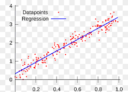

<!DOCTYPE html>
<html>
  <head>
    <meta charset="UTF-8">
  </head>
  <body>
    <h1>Machine Learning Bootcamp Learning Material</h1>
    
This repository contains learning materials for various machine learning algorithms, data cleaning techniques, and exploratory data analysis.

    <h2>Topics Covered</h2>
    <ul>
      <li>Linear Regression</li>
      <li>Logistic Regression</li>
      <li>Decision Trees and Random Forests</li>
      <li>Support Vector Machines</li>
      <li>K-Nearest Neighbors</li>
      <li>Clustering Algorithms</li>
      <li>Dimensionality Reduction Techniques</li>
      <li>Exploratory Data Analysis</li>
      <li>Data Cleaning Techniques</li>
    </ul>
    <h2>Resources Used</h2>
    <ul>
      <li>Scikit-learn documentation at <a href="https://scikit-learn.org/stable/documentation.html">https://scikit-learn.org/stable/documentation.html</a></li>
      <li>Machine Learning Mastery at <a href="https://machinelearningmastery.com/">https://machinelearningmastery.com/</a></li>
      <li>Udemy Machine Learning Course at <a href="https://www.udemy.com/course/machinelearning/">https://www.udemy.com/course/machinelearning/</a></li>
      <li>Kaggle datasets at <a href="https://www.kaggle.com/datasets">https://www.kaggle.com/datasets</a></li>
    </ul>
    <h2>Output Examples</h2>
    <h3>Linear Regression Output Example</h3>
    
    <h3>Clustering Output Example</h3>
    
    <h3>Data Cleaning Output Example</h3>
    
  </body>
</html>
